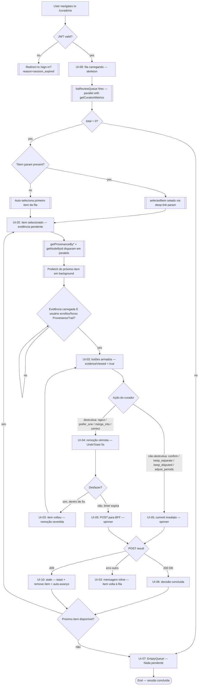
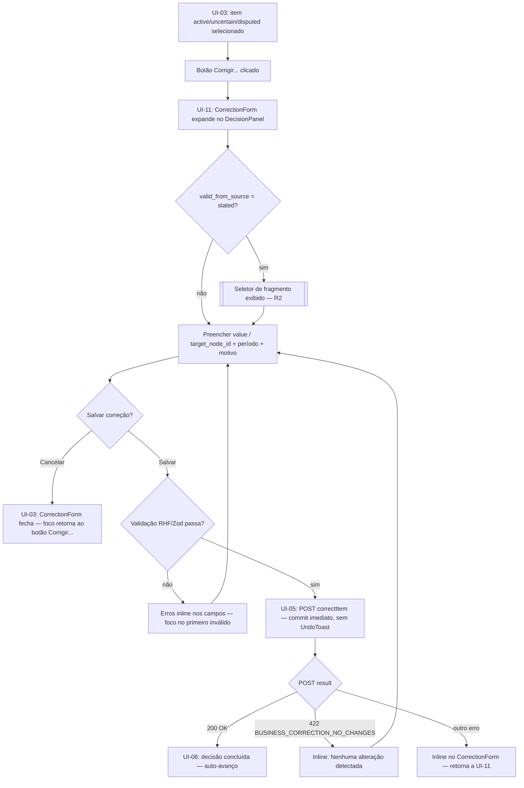
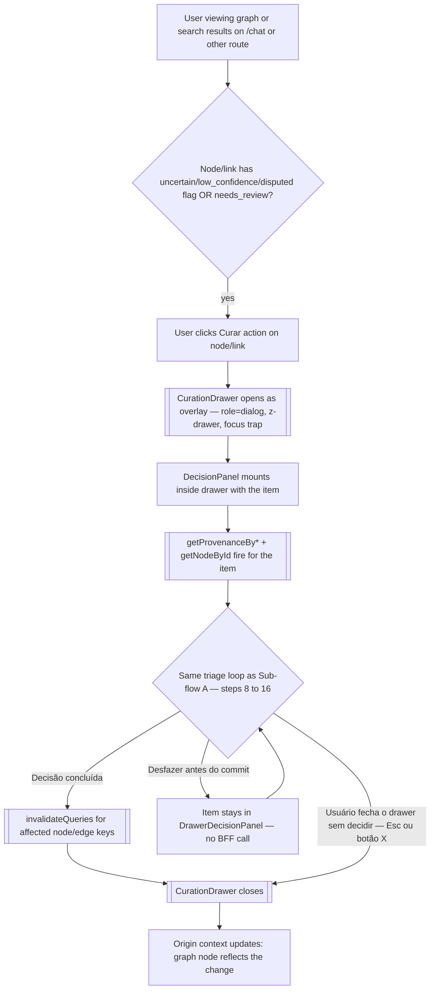
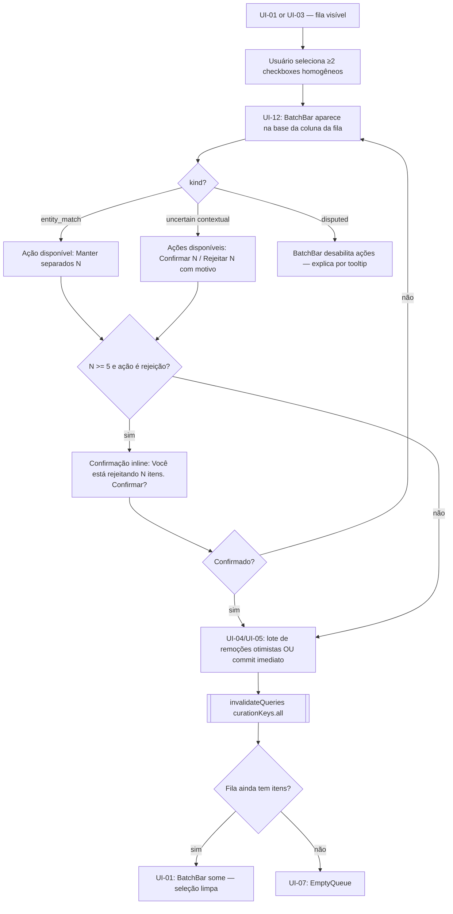

# Curadoria — Flow Spec

> Flow ID: FLOW-CURATION-01 | Objective: Curator reviews, decides, and resolves pending items (entity_match, disputed, uncertain) through the triage queue or contextually from the graph/search | Status: draft | Layer: permanent
> Domains involved: curation (primary writes) · knowledge-graph (node reads, history) · query-retrieval (provenance, fragment lookup)

---

## 1. Involved Features

> Every feature listed here must have a corresponding .feature.spec.md.

| # | Route | Feature Spec | Primary Domain |
|---|-------|-------------|----------------|
| 1 | `/curadoria` | `features/curadoria.feature.spec.md` | curation |
| 2 | `/chat` | `features/chat.feature.spec.md` | chat (CurationDrawer trigger from graph) |
| 3 | `/sign-in` | `features/sign-in.feature.spec.md` | auth (guard redirect) |

---

## 2. Happy Path

### Sub-flow A — Entry and triage queue loop (primary path)

**Detailed steps:**

1. User navigates to `/curadoria` (via header badge, deep-link, or direct URL).
2. `protectedLayoutRoute.beforeLoad` checks `useAuthStore.isFresh()`. If false → redirect to `/sign-in?reason=session_expired`.
3. `/curadoria` mounts in UI-08 (loading): `QueueList` shows 5 skeleton rows; `MetricsStrip` shows skeleton; `DecisionPanel` shows placeholder.
4. In parallel: `listReviewQueue` (staleTime: 0, polling: 30s) + `getCurationMetrics` (staleTime: 30s, degradation R1) both fire.
5. If `?item=<kind>:<id>` is present in the URL: `selectedItem` is set directly from the param → jumps to step 8. Otherwise: if `total > 0`, the first item is auto-selected (step 7). If `total === 0` → UI-07.
6. Auto-selects the first item in the queue (`selectedItem = items[0]`); `curationStore.evidenceViewed = false`.
7. Parallel evidence loads begin: `getProvenanceByLink` or `getProvenanceByAttribute` (by item_kind) + `getNodeById` (for entity_match candidates or disputed link target). Background prefetch of the next item begins simultaneously.
8. UI-02: item header is visible immediately (data from the queue). `ComparePane` and `ProvenanceTrail` show their own skeletons. `DecisionBar` buttons are visible but `aria-disabled="true"` with tooltip "Veja a evidência antes de decidir". `EvidenceChip` pulses.
9. When evidence loads AND the user scrolls to / focuses on `ProvenanceTrail`: `curationStore.evidenceViewed = true` → UI-03. `EvidenceChip` transitions to "visto" state. Decision buttons become interactive.
10. **For non-destructive actions** (`confirm`, `keep_separate`, `keep_disputed`, `adjust_periods`): POST is dispatched immediately (UI-05). Spinner shows on the button.
11. **For destructive actions** (`reject`, `prefer_one`, `merge_into`, `correct`): the item is removed optimistically from the queue. `UndoToast` appears via sonner with a 5-second countdown. No BFF request fires during the window. Auto-advance to the next item in UI-02 of the next item.
12. If "Desfazer" is clicked within 5 seconds: optimistic removal is reverted; timer cancelled; no `CurationAction` created. Returns to UI-03 for that same item.
13. If the 5-second timer expires: POST fires to the BFF (UI-05).
14. On POST 200: `invalidateQueries(curationKeys.all)` + node/edge keys; `curationStore.sessionResolved++`; auto-advance to the next pre-fetched item (< 50 ms, UI-06 → next item's UI-02).
15. On POST 409 (`BUSINESS_REVIEW_NOT_PENDING` / `BUSINESS_ITEM_NOT_DISPUTED`): toast "Já resolvido em outro lugar." + item removed from queue + auto-advance.
16. On POST other error: inline error message in `DecisionPanel`; item returned to queue; returns to UI-03.
17. When all items are resolved: auto-advance reaches UI-07 (EmptyQueue). `MetricsStrip` remains visible.

---

### Sub-flow B — CorrectionForm (errata UC-10)

**Detailed steps:**

1. In UI-03, user clicks "Corrigir…" button. `CorrectionForm` expands inline within `DecisionPanel` (no modal). Focus moves to the first field.
2. Form fields adapt by `item_kind`: attribute → `value` + period (`valid_from`/`valid_to`) + `DateJustification`; link → `target_node_id` + period.
3. If `valid_from_source = stated` is selected in `DateJustification`: the fragment selector (R2) is shown. "Salvar correção" is disabled until a fragment is selected.
4. User fills all required fields and clicks "Salvar correção". RHF/Zod validation runs. On failure: inline errors shown, focus moved to the first invalid field.
5. On valid: POST `correctItem` fires immediately (no UndoToast — correction is not a destructive action in the UndoToast sense; the reversal mechanism is a new `correctItem` with the original values).
6. On 200: `invalidateQueries` for the affected node/attribute + `curationKeys.all`; auto-advance to next item.
7. On 422 `BUSINESS_CORRECTION_NO_CHANGES`: inline error "Nenhuma alteração detectada." — form stays open.
8. On "Cancelar": `CorrectionForm` closes; focus returns to the "Corrigir…" button.

---

### Sub-flow C — CurationDrawer: contextual curation from graph/search

**Detailed steps:**

1. On any route where a graph node or search result is displayed (e.g., `/chat` with the graph pane, or a future `/busca` route): nodes/links flagged `uncertain`, `low_confidence`, `disputed`, or `needs_review` expose a "Curar" action button (in `NodeDetailPanel`, in graph node context menu, or in search result cards).
2. User clicks "Curar". `CurationDrawer` opens as an overlay at `z-drawer`. `role="dialog"`, `aria-modal="true"`, `aria-label="Curadoria"`, focus trap active. The underlying route is still mounted but non-interactive.
3. `DecisionPanel` mounts inside the drawer pre-loaded with the specific item (passed as prop: `kind`, `item_id`, `item_kind`). The queue is NOT shown inside the drawer (no `QueueList`).
4. The same evidence-first, decision-armed loop runs as in Sub-flow A (steps 8–16), but scoped to this single item.
5. On decision success: `invalidateQueries` for the affected node/edge cache keys. `CurationDrawer` closes.
6. Back in the origin context: the graph or search component refetches the node (`getNodeById`) and reflects the updated state (e.g., `uncertain` → `active`).
7. If user presses `Esc` or clicks the "×" button without deciding: `CurationDrawer` closes. No action taken. Focus returns to the element that triggered the drawer.
8. UndoToast within the drawer: the same 5-second window applies. If "Desfazer" is clicked within the drawer, the item returns to the decision state inside the drawer. No auto-advance (the drawer has only one item). The drawer stays open.

---

### Sub-flow D — Batch mode

**Detailed steps:**

1. In UI-01 or UI-03, user checks ≥ 2 checkboxes on `QueueItem` rows. Selection must be homogeneous (same `kind`). Heterogeneous selection: `BatchBar` shows a warning explaining the constraint.
2. UI-12: `BatchBar` appears above the pagination at the base of the queue column. Shows "N selecionados" + available actions for the selected `kind`.
3. `entity_match` items → only "Manter separados N" is available in batch (merge requires individual target selection).
4. `uncertain` contextual items → "Confirmar N" (commit immediately, no UndoToast) and "Rejeitar N com motivo" (shared reason field in `BatchBar`).
5. `disputed` items → `BatchBar` shows all batch actions as disabled with tooltip explaining they require individual resolution.
6. For batch rejection of ≥ 5 items: a single inline confirmation prompt appears within `BatchBar` ("Você está rejeitando N itens. Confirmar?"). No modal dialog. Confirm → proceed. Cancel → stays in UI-12.
7. For destructive batch (reject): optimistic removal of all selected items + batch `UndoToast` ("N itens removidos · Desfazer (5s)"). Non-destructive batch: commit immediately.
8. After batch commit: `invalidateQueries(curationKeys.all)`. `selectedItems` cleared. `BatchBar` disappears. Returns to UI-01 with updated queue.

---

## 3. Alternative Flows

| # | Condition | From | To | Behavior |
|---|-----------|------|----|----------|
| 3a | `listReviewQueue` rejects (network/server error) | UI-08 | UI-09 | Banner inline com `AlertTriangle` + "Não foi possível carregar a fila. Tente novamente." + botão "Tentar novamente" (`refetch()`) |
| 3b | Deep-link `?item=<kind>:<id>` but item not found in queue | UI-08 / UI-01 | UI-01 | Item não encontrado na fila → silently ignored; auto-selects first item; no error shown |
| 3c | Item becomes stale on window refocus (`revalidateOnWindowFocus`) | UI-02 / UI-03 | UI-10 | `StaleBanner` appears over `DecisionPanel`: "Este item mudou desde que você o abriu. Recarregar." with `role="alert"` |
| 3d | POST returns 409 (`BUSINESS_REVIEW_NOT_PENDING` or `BUSINESS_ITEM_NOT_DISPUTED`) | UI-05 | UI-10 → auto-advance | Toast "Já resolvido em outro lugar."; item removed from queue; auto-advance |
| 3e | POST returns 410 (`BUSINESS_NODE_DELETED` or `BUSINESS_RAW_INFORMATION_DELETED`) | UI-05 | UI-01 / UI-07 | Toast "Este nó foi excluído por conformidade."; item removed from queue; auto-advance |
| 3f | POST returns 404 (`RESOURCE_NOT_FOUND`) | UI-05 | UI-01 / UI-07 | Toast "Item não encontrado."; item removed; auto-advance |
| 3g | POST returns 422 (`BUSINESS_REASON_REQUIRED`) | UI-05 | UI-03 | `ReasonField` highlighted (`--color-border-error`); focus moves to field; inline error |
| 3h | POST returns 422 (`BUSINESS_TEMPORAL_INCOHERENT`) | UI-05 | UI-03 | Period field highlighted; `aria-invalid`; inline "O início deve ser anterior ao fim." |
| 3i | POST returns 500 (`SYSTEM_INTERNAL_ERROR`) | UI-05 | UI-03 | Toast `danger` + banner+retry in affected panel; item returned to queue |
| 3j | POST returns 401 (`AUTH_UNAUTHORIZED` / `AUTH_TOKEN_EXPIRED`) | Any | `/sign-in?reason=session_expired` | Global `QueryCache.onError` (see `front.md §5`): clear token + redirect |
| 3k | `ProvenanceTrail` data: `BUSINESS_RAW_INFORMATION_DELETED` (410 from query-retrieval) | UI-02 / UI-03 | UI-02 / UI-03 | Inline warning in `ProvenanceTrail` (`bg-warning`, `role="alert"`): "A fonte original foi excluída por conformidade. Sem proveniência disponível." Decision buttons remain blocked (evidenceViewed stays false — no evidence available to view) |
| 3l | Polling (30s interval) detects `total` grew (new items added by LLM) | Any UI state | Same UI state + pill "N novos" | `curationStore.lastSeenTotal` compared; pill "N novos" appears in header with `role="status"`. Does not interrupt current decision |
| 3m | `CurationDrawer` opened on an item that is already being processed (409 on commit) | CurationDrawer UI-05 | CurationDrawer UI-03 | Same as 3d inside drawer — toast + drawer closes (item gone); focus returns to origin |
| 3n | User navigates away from `/curadoria` while UndoToast is active (5s window) | UI-04 (any) | Any other route | On navigation: pending destructive action is committed immediately (no undo possible after navigation). A brief "Ação comprometida ao sair." toast fires before unmount |
| 3o | `CorrectionForm` — `valid_from_source = stated` but no fragments available (R2 endpoint absent) | UI-11 | UI-11 | Fragment selector shows degraded "modo avançado": plain text input for `fragment_id` with instructional placeholder "Cole o ID do fragmento (modo avançado)" |

**State transition table:**

| Current State | Event | Condition | Next State | Action |
|---|---|---|---|---|
| Any protected route | `beforeLoad` fires | `isFresh() === false` | `/sign-in` | redirect |
| UI-08 (fila carregando) | `listReviewQueue` resolve, `total > 0`, `?item` ausente | — | UI-02 (primeiro item) | auto-seleciona primeiro item; `evidenceViewed = false` |
| UI-08 (fila carregando) | `listReviewQueue` resolve, `total > 0`, `?item` presente | item existe na fila | UI-02 (item do param) | `selectedItem` setado via param; `evidenceViewed = false` |
| UI-08 (fila carregando) | `listReviewQueue` resolve, `total = 0` | — | UI-07 | badge some do header |
| UI-08 (fila carregando) | `listReviewQueue` rejeita | — | UI-09 | `role="alert"` banner com retry |
| UI-01/UI-07 (idle/vazio) | `QueueItem` clicado | — | UI-02 | `selectedItem` setado; `evidenceViewed = false`; evidence queries disparam |
| UI-02 (evidência pendente) | Evidence carregada E usuário scrollou/focou `ProvenanceTrail` | — | UI-03 | `evidenceViewed = true`; `EvidenceChip` para de pulsar |
| UI-02 (evidência pendente) | 410 `BUSINESS_RAW_INFORMATION_DELETED` em `getProvenanceBy*` | — | UI-02 (bloqueado) | inline warning em `ProvenanceTrail`; botões permanecem `aria-disabled` |
| UI-03 (botões armados) | Ação não-destrutiva disparada | — | UI-05 | POST imediato; spinner no botão |
| UI-03 (botões armados) | Ação destrutiva disparada | — | UI-04 | remoção otimista; `UndoToast` 5s; auto-avanço para próximo |
| UI-03 (botões armados) | "Corrigir…" clicado | item não terminal (não deleted/superseded) | UI-11 | `CorrectionForm` expande; foco move para primeiro campo |
| UI-03 (botões armados) | ≥2 checkboxes selecionados | homogêneos (mesmo kind) | UI-12 | `BatchBar` aparece |
| UI-03 (botões armados) | `revalidateOnWindowFocus` — item mudou | stale detectado | UI-10 | `StaleBanner` com `role="alert"` |
| UI-04 (UndoToast ativo) | "Desfazer" clicado | dentro de 5s | UI-03 | remoção otimista revertida; timer cancelado; nenhum request |
| UI-04 (UndoToast ativo) | Timer expira (5s) | — | UI-05 | POST para BFF; spinner no toast |
| UI-04 (UndoToast ativo) | Usuário navega para outra rota | — | outra rota | ação comprometida imediatamente; toast "Ação comprometida ao sair." |
| UI-05 (POST em andamento) | POST retorna 200 | — | UI-06 | `invalidateQueries(curationKeys.all)` + chaves do nó/aresta; `sessionResolved++` |
| UI-05 (POST em andamento) | POST retorna 409 `REVIEW_NOT_PENDING` / `ITEM_NOT_DISPUTED` | — | UI-10 → auto-avanço | toast "Já resolvido em outro lugar."; remove item; auto-advance |
| UI-05 (POST em andamento) | POST retorna 410 `NODE_DELETED` | — | UI-01 / UI-07 | toast warning; remove item; auto-advance |
| UI-05 (POST em andamento) | POST retorna 404 `RESOURCE_NOT_FOUND` | — | UI-01 / UI-07 | toast warning; remove item; auto-advance |
| UI-05 (POST em andamento) | POST retorna 422 `REASON_REQUIRED` | — | UI-03 | `ReasonField` realçado; foco move para campo |
| UI-05 (POST em andamento) | POST retorna 422 (outros) | — | UI-03 | inline error no `DecisionPanel`; item volta à fila |
| UI-05 (POST em andamento) | POST retorna 500 `SYSTEM_INTERNAL_ERROR` | — | UI-03 | toast danger + banner+retry |
| UI-05 (POST em andamento) | POST retorna 401 | — | `/sign-in?reason=session_expired` | global `QueryCache.onError`; clear token; redirect |
| UI-06 (decisão concluída) | Próximo item disponível (pré-carregado) | — | UI-02 (próximo) | `selectedItem` = próximo; `evidenceViewed = false` |
| UI-06 (decisão concluída) | Fila esgotada após decisão | — | UI-07 | `selectedItem = null`; badge some |
| UI-11 (CorrectionForm) | "Cancelar" clicado | — | UI-03 | `CorrectionForm` fecha; foco retorna ao botão "Corrigir…" |
| UI-11 (CorrectionForm) | "Salvar correção" clicado | RHF/Zod válido | UI-05 | POST `correctItem` imediato (sem UndoToast) |
| UI-11 (CorrectionForm) | "Salvar correção" clicado | RHF/Zod inválido | UI-11 | erros inline; foco no primeiro campo inválido |
| UI-11 (CorrectionForm) | POST retorna 422 `CORRECTION_NO_CHANGES` | — | UI-11 | inline "Nenhuma alteração detectada." |
| UI-12 (BatchBar ativa) | Deselecionar até <2 itens | — | UI-01 ou UI-03 | `BatchBar` some; `selectedItems` limpo |
| UI-12 (BatchBar ativa) | Ação de lote não-destrutiva disparada | — | UI-05 | commit imediato; botões do lote desabilitados durante request |
| UI-12 (BatchBar ativa) | Ação de lote destrutiva disparada | — | UI-04 | remoção otimista em lote; `UndoToast` "N itens removidos · Desfazer (5s)" |
| Any | `?item` param na URL muda | — | UI-02 (item do param) | `selectedItem` atualizado; `evidenceViewed = false` |
| Any | polling 30s — `total` cresceu | — | Mesma UI + pill "N novos" | `lastSeenTotal` comparado; `role="status"` pill aparece |
| Any | `CurationDrawer` abre (contextual) | — | UI-02 in-drawer | drawer monta `DecisionPanel`; contexto de origem preservado |
| CurationDrawer UI-06 | Decisão concluída no drawer | — | drawer fecha | `invalidateQueries` para nó/aresta; origin context refetches |
| CurationDrawer any | `Esc` / botão X clicado | — | drawer fecha | nenhuma ação; foco retorna ao elemento que abriu o drawer |

---

## 4. Navigation Rules (FL)

### FL-CURATION-01 — Guard: unauthenticated user blocked

**Condition:** user navigates to `/curadoria` without a fresh JWT in `useAuthStore`.
**Behavior:** `protectedLayoutRoute.beforeLoad` detects `isFresh() === false` and throws `redirect({ to: "/sign-in", search: { reason: "session_expired" } })`.
**Fallback:** if the redirect itself fails (router error), the `AppErrorBoundary` renders in-frame with a "Faça login novamente." message and a link to `/sign-in`.

### FL-CURATION-02 — Deep-link: pre-select item from external context

**Condition:** `/curadoria?item=<kind>:<id>` is accessed (from a chat message, graph node, email notification, or any deep-link).
**Behavior:** on mount, after `listReviewQueue` resolves, `useSearchParams` reads `item=<kind>:<id>`. If the item exists in the queue, `selectedItem` is set to it and the view enters UI-02 directly. If `?item` changes at runtime (pushState), the same resolution runs.
**Fallback:** if the item is not found in the queue (already resolved, invalid id, or wrong kind): the param is silently ignored; the view auto-selects the first available item (or enters UI-07 if queue is empty). No error is shown to the user (the item may have been resolved between the time the link was generated and when it was clicked).

### FL-CURATION-03 — CurationDrawer: contextual entry from graph/search

**Condition:** user clicks "Curar" on a node/link/attribute flagged as `uncertain`, `low_confidence`, `disputed`, or `needs_review` in any view that renders the graph or search results (primarily `/chat` right column via `NodeDetailPanel`).
**Behavior:** `CurationDrawer` opens as an overlay at `z-drawer` level. The underlying route remains mounted but non-interactive (covered by the drawer backdrop). `DecisionPanel` is mounted inside the drawer with the specific item context. The full evidence-first triage loop runs within the drawer. On decision success, `CurationDrawer` closes and `invalidateQueries` for the affected node/edge keys is called — the graph or search result in the origin route reflects the change without a full page navigation.
**Fallback:** if `getProvenanceBy*` or `getNodeById` fail to load inside the drawer: inline error is shown; "Abrir na fila de curadoria" link is offered as an escape hatch, navigating to `/curadoria?item=<kind>:<id>`.

### FL-CURATION-04 — Auto-advance after decision (queue loop)

**Condition:** a decision (POST) returns 200 in UI-05, or a 409/410/404 removes an item from the queue.
**Behavior:** `selectedItem` is updated to the next item in the pre-fetched queue. The transition to UI-02 of the next item takes less than 50 ms because `queryClient.prefetchQuery` already loaded the evidence for the next item while the current decision was being made. Focus moves to the `DecisionPanel` header of the newly selected item.
**Fallback:** if the pre-fetch did not complete (network slow, item was the last in the queue page): a brief skeleton (UI-02) is shown while the evidence loads for the next item. If no next item exists → UI-07.

### FL-CURATION-05 — UndoToast: destructive action pre-commit window

**Condition:** a destructive action (`reject`, `prefer_one`, `merge_into`, `correct`) is triggered in UI-03.
**Behavior:** the item is removed optimistically from `QueueList`. `UndoToast` appears via sonner with a 5-second visible countdown. No BFF request is made during this window. If "Desfazer" is clicked: optimistic removal is reverted; timer is cancelled; no `CurationAction` is created. If the timer expires: POST fires (UI-05). The 5-second window is the only mechanism for reversing a destructive decision — there is no "undo after commit" path (spec constraint: imutabilidade).
**Fallback:** if the user navigates away from `/curadoria` during the 5-second window: the pending action is committed immediately on `beforeunload` / navigation teardown. A brief toast "Ação comprometida ao sair." fires.

### FL-CURATION-06 — Concurrency: 409 stale item handling

**Condition:** POST returns 409 with `BUSINESS_REVIEW_NOT_PENDING` or `BUSINESS_ITEM_NOT_DISPUTED` (the item was resolved in another session — e.g., by the LLM or another browser tab).
**Behavior:** the item is removed from the queue (already removed optimistically if destructive; removed now if non-destructive). Toast "Já resolvido em outro lugar." Automatic advance to the next item. `invalidateQueries(curationKeys.all)` to sync the queue with the server state.
**Fallback:** if the auto-advance fails (no next item): transitions to UI-07.

### FL-CURATION-07 — Polling: new items notification

**Condition:** the 30-second polling interval detects that `listReviewQueue.total` has grown compared to `curationStore.lastSeenTotal` (new items ingested by the LLM while the curator was working).
**Behavior:** pill "N novos" appears in the header with `role="status"` (announced via `aria-live="polite"`). The current decision in progress is **not interrupted**. The pill persists until the curator navigates or refreshes the queue (e.g., by advancing to the next item, at which point `lastSeenTotal` is updated to the new total).
**Fallback:** if polling fails silently (network blip): no notification. The queue will resync on the next successful poll or on `refetchOnWindowFocus`.

### FL-CURATION-08 — Navigation away during active session

**Condition:** user navigates away from `/curadoria` (e.g., back to `/chat`) while in any UI state.
**Behavior:** TanStack Query cache persists (staleTime applies) — if the user returns within the staleTime of `listReviewQueue` (0s — always refetches), the queue reloads from scratch. `curationStore.sessionResolved` and `curationStore.lastSeenTotal` persist in Zustand for the session (reset on logout). If a `UndoToast` is active, the pending action is committed before unmount (FL-CURATION-05 fallback).
**Fallback:** if the user returns and the queue has changed significantly (many new items, or the previously selected item is gone), the view re-enters UI-08 → UI-01 cleanly.

---

## 5. Deep Links and Alternative Entries

| Direct route | Precondition | Behavior if not met |
|-------------|--------------|---------------------|
| `/curadoria` | Fresh JWT in `useAuthStore` | Redirect to `/sign-in?reason=session_expired` |
| `/curadoria?item=entity_match:<uuid>` | Fresh JWT + item exists in queue | Auth guard: redirect to `/sign-in` if no JWT. If item not found in queue: silently ignored, auto-selects first item |
| `/curadoria?item=disputed:<uuid>` | Fresh JWT + item exists in queue | Same as above |
| `/sign-in?redirect=/curadoria%3Fitem%3Dentity_match%3A<uuid>` | — (public route) | After sign-in, navigates to `/curadoria?item=entity_match:<uuid>` (safe-redirect check: same-origin relative path) |
| `CurationDrawer` (no URL change) | Fresh JWT + valid `kind`/`item_id` props from origin | If `getProvenanceBy*` fails: inline error in drawer + "Abrir na fila" escape link |

---

## 6. Data Persisted Between Screens

| Data | From | To | Mechanism |
|------|------|----|-----------|
| JWT (access token) | `/sign-in` | `/curadoria` (and all protected routes) | `sessionStorage["remember.auth.token"]` via `useAuthStore` |
| `selectedItem` (item selecionado na fila) | `/curadoria` (fila) | `/curadoria` (painel de decisão) | `curationStore` (Zustand, in-memory, no persistence) |
| `evidenceViewed` flag | `/curadoria` (ProvenanceTrail) | `/curadoria` (DecisionBar) | `curationStore` (Zustand, in-memory) — reset to `false` on each new `selectedItem` |
| `sessionResolved` counter | `/curadoria` (decisões) | `/curadoria` (rodapé do painel) | `curationStore` (Zustand, in-memory) — reset on logout |
| `lastSeenTotal` (total da última visita) | `/curadoria` (mount / after decision) | `/curadoria` header (pill "N novos") | `curationStore` (Zustand, in-memory) — persists for the session |
| `selectedItems` (batch selection) | `/curadoria` (QueueList checkboxes) | `/curadoria` (BatchBar) | `curationStore` (Zustand, in-memory) — cleared after batch action or deselection |
| Deep-link `?item` param | external context (graph, chat, email) | `/curadoria` (item pre-selection) | URL search param (`?item=<kind>:<id>`) — consumed on mount |
| Drawer origin context (`kind`, `item_id`, origin route) | Any route with CurationDrawer trigger | `CurationDrawer` (DecisionPanel) | Props passed to `CurationDrawer` on open — not persisted to URL |
| Queue cache (TanStack Query) | `/curadoria` (listReviewQueue) | Returns to `/curadoria` within staleTime | TanStack Query cache (in-memory, staleTime: 0 — always refetches on remount) |
| Node/provenance cache (TanStack Query) | `/curadoria` (evidence queries) | `/curadoria` (same session) or `CurationDrawer` | TanStack Query cache (staleTime: 5min for node/provenance data) |

---

## Changelog

| Version | Date | Author | Type | Description | CR |
|---------|------|--------|------|-------------|----|
| 1.0.0 | 2026-06-24 | Front Spec Agent | initial | Curadoria flow spec: FLOW-CURATION-01 through FLOW-CURATION-08. Covers deep-link entry (FL-CURATION-02), triage queue loop (Sub-flow A), CorrectionForm errata (Sub-flow B), CurationDrawer contextual curation from graph/search (Sub-flow C, FL-CURATION-03), batch mode (Sub-flow D), UndoToast pre-commit window (FL-CURATION-05), concurrency 409 handling (FL-CURATION-06), polling new-items notification (FL-CURATION-07), navigation-away teardown (FL-CURATION-08). Full state transition table covering all UI-01..UI-12 states and CurationDrawer. | sdd_improve_2 |
